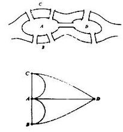
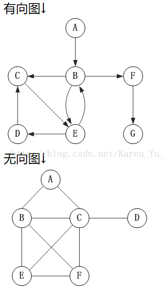

## 图论基础知识

七桥问题
问题描述：

**18世纪著名古典数学问题之一。在哥尼斯堡的一个公园里，有七座桥将普雷格尔河中两个岛及岛与河岸连接起来(如图)。问是否可能从这四块陆地中任一块出发，恰好通过每座桥一次，再回到起点？欧拉于1736年研究并解决了此问题，他把问题归结为如右图的“一笔画”问题，证明上述走法是不可能的**

定点vetex(V)

边edge(E)

图 graph(G)

G = (V,E)

V= {v1,v2.....v}顶点集

E={e1,e2,....e}边集

**如果两个顶点公=共用同一条边则 两个顶点相邻**

**两个端点重合的边 环**

**边有方向的图称为有向图  无方向的为无向图**

__有向图则分出度与入度__

**每个顶点的度数是一固定的整数 则改图称为正则图**

**握手定理**

## 同构

+ 边数相同，点数相同

+ 度序列相同

  ​

  **握手定理**

  定理14.1(握手定理) 设G=<V,E>为任意无向图，V={v1,v2,…,vn}，|E|=m，则

  所有顶点的度数和=2m

  证 G中每条边(包括环)均有两个端点，所以在计算G中各顶点度数之和时，每条边均提供2度，当然，m条边，共提供2m度。

  定理14.2(握手定理) 设D=<V,E>为任意有向图，V={v1,v2,…,vn}，|E|=m，则

  所有顶点的度数和=2m，且出度=入度=m.

  本定理的证明类似于定理14.1

  握手定理的推论 任何图(无向的或有向的)中，奇度顶点的个数是偶数。

  ​

  ​

